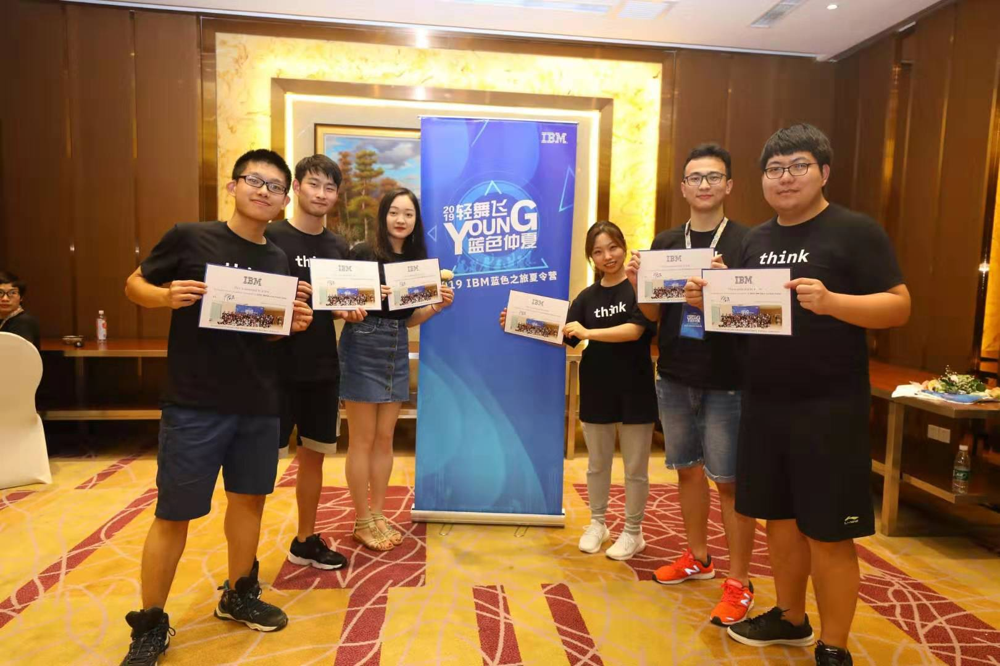

# 2019 IBM Blue Summer Camp

## 1. Poster

## 2. Calendar

|               | Day 0 - Aug 5                                                | Day 1 - Aug 6                                                | Day 2 - Aug 7                                                | Day 3 - Aug 8                                                |
| ------------- | :----------------------------------------------------------- | :----------------------------------------------------------- | :----------------------------------------------------------- | :----------------------------------------------------------- |
| 9:00 - 12:00  |                                                              | **Orientation** • IBM Client Center tour • IBM THINK Lab tour **Journey to AI (Part1)** • AI for Business  • Cognitive Healthcare • PowerAI Vision • AI for IT | **Journey to Cloud** • Journey to Cloud • IBM & Red Hat **Journey to Modern Infrastructure** • IBM System Lab tour • HPC and POWER • Blockchain on LinuxONE | **Journey to Cognitive Enterprise** • IBM Transformation • IBM Service and Consultant • Cognitive Enterprise **Meet with IBM GCG Chairman** |
| 12:00 - 13:30 |                                                              | **Lunch Meeting with IBM Researcher**                        | **Lunch Meeting with IBM Researcher**                        | **Lunch**                                                    |
| 13:30 - 17:30 | Gathering and Dinner                                         | **Journey to AI (Part2)** • AI Ladder - From IA to AI • Data Science & IBM Watson Studio **Group Competition #1 Day 1 Recap** | **Journey to Innovation Method** • IBM Garage • Design Thinking **Group Competition #2** **Day 2 Recap** | **Journey to Blue Pathway** • Career @ IBM • Career Go • 2020 IBM Campus Recruitment **Group Competition #3** **Journey to Space** **Journey to Space** |
| 18:30 -       | **Opening** • Kick off • Ice-breaking and Grouping • Creation EXPO | **Dinner and Homework**                                      | **Dinner and Homework**                                      | **Gala Dinner**                                              |

## 3. Our Team

## 4. Our Works

- Data Science
- Design Thinking
- Topic Show

## 5. Highlights

[as]: ./utils/1566341572207334.mp4

